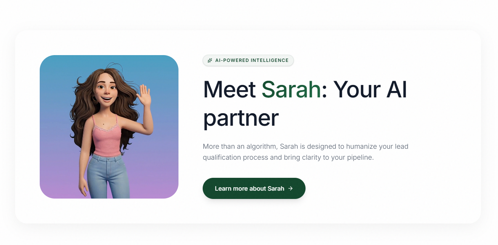

# Language / Idioma
- [Português](#-como-criar-um-mvp-do-zero)
- [English](#-how-to-build-an-mvp-from-scratch)

---

 

# Como Criar um MVP do Zero

Olá e seja muito bem-vindo(a)!

Este repositório é um guia completo e prático, criado com o propósito exclusivo de te ensinar, passo a passo, **como planejar, desenvolver e lançar um MVP (Produto Mínimo Viável) do absoluto zero**, e o mais importante: **como conquistar o seu primeiro cliente real**.

Muitos desenvolvedores e empreendedores travam na hora de tirar uma ideia do papel. O objetivo aqui é focar na execução, na escolha das ferramentas certas (sem perder tempo com complexidade desnecessária) e em estratégias reais de vendas e validação.

## O Poder de um Ícone Carismático

Antes mesmo de falarmos sobre código e vendas, vale destacar um detalhe que muitos ignoram: **a identidade e a conexão emocional**. 

Aplicações de sucesso muitas vezes adotam personagens, mascotes ou ícones muito carismáticos (como o macaquinho do Mailchimp ou a coruja do Duolingo). Isso não é por acaso. Um personagem bem pensado:
- **Gera empatia:** Torna um software que seria frio e técnico em algo amigável.
- **Ajuda no Onboarding:** Um mascote guiando o usuário nos primeiros passos reduz o atrito e aumenta a retenção.
- **Fortalece a Marca:** Facilita a lembrança da sua solução no mercado.

Nunca subestime o poder de um bom design e de uma interface que "sorri" para o seu usuário!

## O que você vai aprender aqui?

Este guia está sendo estruturado em três pilares principais:

### 1. Planejamento e Visão do Produto (MVP)
Antes de escrever qualquer linha de código, você precisa saber o que está construindo.
- O que realmente é um Produto Mínimo Viável (e o que não é).
- Como definir as funcionalidades essenciais (o "core") da sua aplicação.
- Como validar rápido a sua ideia e o problema do seu público.

### 2. A Stack Tecnológica (A Mão na Massa)
Você não precisa da arquitetura mais complexa do mundo para começar. Vamos abordar de forma prática:
- **Frontend:** Como criar interfaces bonitas, modernas e responsivas rapidamente utilizando ferramentas atuais (ex: React, Next.js, Tailwind CSS).
- **Backend & Banco de Dados:** Como estruturar a lógica do seu negócio, gerenciar usuários e armazenar dados de forma segura (ex: Node.js, Supabase, Firebase ou PostgreSQL).
- **Hospedagem (Deploy):** Onde e como hospedar o seu MVP de forma gratuita ou com custo baixíssimo no início (ex: Vercel, Render, Heroku).

### 3. A Conquista do 1º Cliente (O Lançamento)
Um produto incrível sem usuários é apenas código morto. Vamos te mostrar o caminho das pedras:
- Como estruturar o seu discurso (Pitch de Vendas).
- Estratégias práticas e acessíveis de prospecção (Cold E-mail, LinkedIn, participações em Comunidades).
- Como conduzir as primeiras demonstrações do seu produto (Demos).
- Estratégias de precificação iniciais para fechar o seu primeiro negócio.

## Como usar este repositório
Nosso objetivo é transformar este espaço em um passo a passo vivo. Ao longo do tempo, este repositório será preenchido com módulos, exemplos de código, templates de projeto e checklists para garantir que você tenha um mapa completo da jornada.

Sinta-se à vontade para dar uma Star neste repositório e acompanhar cada atualização!

---

 

# How to Build an MVP from Scratch

Hello and welcome!

This repository is a comprehensive and practical guide, created with the exclusive purpose of teaching you, step-by-step, **how to plan, develop, and launch an MVP (Minimum Viable Product) from absolute scratch**, and most importantly: **how to get your very first paying customer**.

Many developers and entrepreneurs get stuck when trying to bring an idea to life. The goal here is to focus on execution, choosing the right tools (without wasting time on unnecessary complexity), and applying real-world sales and validation strategies.

## The Power of a Charismatic Mascot

Before we even talk about code and sales, it is worth highlighting a detail that many ignore: **identity and emotional connection**.

Successful applications often adopt very charismatic characters, mascots, or icons (like Mailchimp's monkey or Duolingo's owl). This is not by accident. A well-designed character:
- **Generates empathy:** It turns a cold, technical software into something friendly.
- **Helps with Onboarding:** A mascot guiding the user through their first steps reduces friction and increases retention.
- **Strengthens Branding:** It makes your solution much easier to remember.

Never underestimate the power of good design and an interface that "smiles" at your user!

## What will you learn here?

This guide is being structured around three main pillars:

### 1. Product Vision & Planning (The MVP)
Before writing any code, you need to know exactly what you are building.
- What a Minimum Viable Product really is (and what it is not).
- How to define the essential core features of your application.
- How to rapidly validate your idea and your target audience's problem.

### 2. The Tech Stack (Hands-on)
You don't need the most complex architecture in the world to get started. We will practically cover:
- **Frontend:** How to build beautiful, modern, and responsive interfaces quickly using current tools (e.g., React, Next.js, Tailwind CSS).
- **Backend & Database:** How to structure your business logic, manage users, and store data securely (e.g., Node.js, Supabase, Firebase, or PostgreSQL).
- **Deployment (Hosting):** Where and how to host your MVP for free or at a very low cost in the beginning (e.g., Vercel, Render, Heroku).

### 3. Getting Your 1st Client (The Launch)
An amazing product with no users is just dead code. We will show you the ropes:
- How to structure your sales pitch.
- Practical and accessible prospecting strategies (Cold E-mail, LinkedIn, Communities).
- How to conduct your first product demonstrations (Demos).
- Initial pricing strategies to close your first deal.

## How to use this repository
Our goal is to turn this space into a living step-by-step guide. Over time, this repository will be populated with modules, code examples, project templates, and checklists to ensure you have a complete map of the journey.

Feel free to give this repository a Star and follow along with every update!
